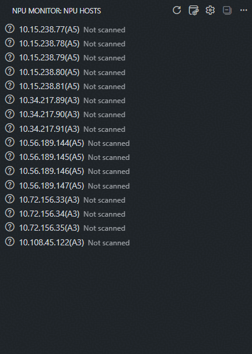

# NPU Monitor for VS Code

[English](README.md) | 简体中文

通过 SSH 监控多台机器上的 Ascend NPU 和 Docker 容器，支持 Windows VS Code
和 WSL VS Code。界面语言跟随 VS Code 的中文或英文设置。

## 功能

- 从 OpenSSH config 自动加载机器。
- 默认自动刷新全部机器的 NPU 状态，也可手动扫描全部、单台或多选机器。
- 记录逐卡空闲历史，并按已观测的连续空闲时长选择机器。
- 订阅机器空闲提醒；启动首轮和手动扫描会刷新容器。
- 优先读取 NPU-Exporter `/metrics`，不可用时快速回退到 `npu-smi info`。
- 按物理 NPU 展示健康状态、利用率、HBM、温度、功耗和进程。
- 监控 Docker 容器，支持按 Dev Container 和工作区目录筛选。
- 通过机器右键菜单复制 SSH 连接信息。
- 在新窗口打开运行中的容器，快速复制容器信息。
- 区分连接超时、认证失败、主机密钥异常和采集失败。

默认首轮扫描全部机器的 NPU 和容器；定时只刷新 NPU，已订阅机器可接收空闲提醒。
手动扫描同时刷新两类数据，不修改订阅列表。



## 环境要求

- VS Code 1.100 或更高版本。
- Windows OpenSSH Client，或 WSL 中的 `/usr/bin/ssh`。
- SSH config 中配置的机器可以免密执行远端只读命令。
- 远端机器安装 `npu-smi`，或运行可访问的 NPU-Exporter。
- 容器监控需要远端 SSH 用户有 Docker 查询权限，本地无需安装 Docker。
- 打开容器需要在本地 VS Code 安装 Dev Containers 和 Remote - SSH。

## 构建和安装

```bash
npm install
npm run check
npm run vsix
code --install-extension release/vscode-npu-monitor-0.2.3.vsix
```

同一个 VSIX 可以安装到 Windows 本地 Extension Host 或 WSL Extension Host。
在 WSL 工作区中，应选择 VS Code 的“Install in WSL”。

开发时可以单独打开本目录并按 `F5` 启动 Extension Development Host：

```bash
code .
```

## 发布

推送与 `package.json` 版本一致的 `vX.Y.Z` 标签后，GitHub Actions 会运行完整
检查、生成 VSIX，并创建包含自动 Release Notes 的 GitHub Release。标签必须指向
`main` 上的提交，并且仅支持稳定的三段式语义版本。

准备新版本时更新 `package.json`、`package-lock.json` 和 `CHANGELOG.md`：

```bash
npm version 0.2.3 --no-git-tag-version
git add package.json package-lock.json CHANGELOG.md
git commit -m "[Release] Prepare v0.2.3"
git push origin main
git tag -a v0.2.3 -m "v0.2.3"
git push origin v0.2.3
```

发布附件名根据版本自动生成，例如
`release/vscode-npu-monitor-0.2.3.vsix`。GitHub 同时提供源码 zip 和 tar.gz。

## 使用

1. 打开 Activity Bar 中的 **NPU Monitor**。
2. 首次进入时扩展加载 SSH config 并扫描全部机器的 NPU 和容器状态。
3. 点击标题栏刷新图标扫描全部机器；在标题栏的更多操作菜单中重新加载 SSH 配置。
4. 使用机器行的刷新图标扫描单台；多选机器后执行“扫描所选机器”。
5. 右键机器可打开 SSH 终端或复制连接信息；复制支持多选机器。
6. 点击铃铛订阅机器；订阅后立即扫描，定时 NPU 扫描可在空闲时提醒。
7. 点击标题栏“选择空闲机器”，查看按已观测连续空闲时长排序的候选；选中后
   定位并展开机器。点击机器行铃铛旁的历史图标，查看按天由近到远排列的逐卡时间线。
8. 机器行小字显示空闲卡数、最长已观测空闲时长、采集时间和容器数量；悬浮可查看完整状态与采集来源。
   展开机器查看 NPU 和容器状态；点击运行中容器的新窗口图标，在独立窗口附加容器。
9. 容器行的复制图标用于“复制精简信息”，右键菜单提供“复制完整信息”，均支持多选。

启动首轮和手动扫描先采集 NPU 数据，再执行只读 Docker 查询。默认展示 Dev Container，并优先使用
配置中的项目名称。采集失败时保留上次成功的数据并标记“数据已过期”。空闲历史从此版本开始在
当前扩展运行环境的本地保存；采集失败、数据不完整或观测超时不会延长连续空闲时长。
修改逐卡空闲阈值或进程规则后，将按新规则重新积累历史。

打开容器时，Remote - SSH 需使用与 NPU Monitor 一致的 SSH 配置和主机别名。

### MCP 接入

点击面板顶部的 MCP 状态行启用服务。Codex、Claude Code 可读取缓存的主机和容器信息，
或显式刷新指定节点。服务使用带鉴权的回环地址（默认端口 `49160`），随窗口关闭而停止；
同一端口只允许一个窗口监听，客户端应运行在相同环境中。

选择“复制 MCP 环境变量”获取地址和 token。在客户端中选择 Streamable HTTP，
使用 `NPU_MONITOR_MCP_URL` 作为地址，将 `NPU_MONITOR_MCP_TOKEN` 配置为
`Authorization: Bearer <token>` 请求头。复制内容含凭据；缓存中的空闲状态不代表设备已被预约。`rank_idle_hosts` 和 `get_idle_history`
只读取本地观测历史，不发起 SSH 查询。MCP 的 NPU 数据及候选结果包含 `collectedAt`、
`ageSeconds`、`maxAgeSeconds`、`validUntil`、`outdated`；有效期为轮询周期的两倍
（默认 360 秒）。容器单独返回 `collectedAt` 和 `ageSeconds`，其 `maxAgeSeconds`、
`validUntil`、`outdated` 均为 `null`，采集失败时查看 `stale`。`refresh_containers` 仅更新容器信息，不重扫 NPU。
`list_host_images` 只读查询最多 20 个 vLLM-Ascend 镜像候选，返回标签、镜像 ID、
创建时间、架构和系统；容器详情也返回实际镜像 ID。新建容器前先展示候选并选择，
复用时核对现用镜像。发现结果不预留资源，执行前仍需复核节点占用。

## 配置

在 VS Code 设置中搜索 `NPU Monitor`：

| 设置 | 默认值 | 说明 |
| --- | --- | --- |
| `mcp.enabled` | `false` | 启用当前工作区 MCP 服务 |
| `mcp.port` | `49160` | MCP 回环监听端口 |
| `sshConfigPath` | Remote - SSH 配置或自动检测 | 显式配置的 NPU Monitor 路径优先级最高；留空时先使用 `remote.SSH.configFile`，再按 Windows / WSL 规则自动检测 |
| `knownHostsPath` | SSH config 同目录 | 主机密钥文件 |
| `sshExecutablePath` | 自动检测 | Windows OpenSSH 或 `/usr/bin/ssh` |
| `connectTimeoutSeconds` | `8` | SSH 连接超时 |
| `exporterProbeTimeoutSeconds` | `2` | Exporter 总探测时间 |
| `npuSmiTimeoutSeconds` | `10` | `npu-smi info` 超时 |
| `maxConcurrentHosts` | `8` | 每个 VS Code 窗口同时扫描的最大机器数 |
| `excludedHosts` | `[]` | 不显示、不扫描的 Host 别名 |
| `devContainers.enabled` | `true` | 启用容器监控 |
| `devContainers.timeoutSeconds` | `5` | 容器查询超时，不含 SSH 连接时间 |
| `containers.filterMode` | `devContainers` | `all` 全部容器、`devContainers` 或 `workspacePaths` 工作区筛选 |
| `containers.workspacePaths` | `[]` | 宿主机工作区目录，仅在 `workspacePaths` 模式生效 |
| `containers.workspaceFile` | 空 | 用于替代容器工作目录打开的 Workspace 文件名 |
| `pollIntervalSeconds` | `180` | NPU 自动轮询周期，最小 10 秒 |
| `autoRefreshAllHosts` | `true` | 启动首轮扫描全部机器的 NPU 和容器，之后仅定时扫描 NPU；关闭后只扫描已订阅机器 |
| `idleHistoryRetentionDays` | `7` | 逐卡历史在本地保留的天数，范围 1–30 |
| `idleScope` | `anyCard` | 要求全部卡或任一卡空闲 |
| `idleRequireNoProcesses` | `true` | 空闲时要求没有 NPU 进程 |
| `idleUtilizationThresholdPercent` | `1` | 空闲利用率上限 |
| `idleConsecutiveChecks` | `1` | 空闲提醒前连续满足次数 |

SSH 相关路径支持 `~`、`${env:NAME}` 和 Windows `%NAME%` 环境变量。WSL 读取 Windows
配置时会自动转换 NPU Monitor 和 Remote - SSH 设置中的 `C:\...` 路径。

在 `workspacePaths` 模式下，填写一个或多个**宿主机** Linux 绝对目录，匹配该目录
及其子目录，区分大小写，不展开 `~`、变量或通配符。空列表显示全部 Dev Container，
其他模式忽略已保存的路径。筛选修改立即作用于缓存数据。

```json
{
  "npuMonitor.containers.filterMode": "workspacePaths",
  "npuMonitor.containers.workspacePaths": ["/home/user", "/mnt/work/user"]
}
```

将 `containers.workspaceFile` 设置为 `vllm-ascend-dev.code-workspace` 之类的文件名，
可从每个已映射容器工作目录的根目录打开该文件；留空时仍打开工作目录。文件名必须以
`.code-workspace` 结尾且不能包含路径分隔符，不展开变量或通配符。扫描只检查该文件
是否为普通文件，不读取文件内容；配置的文件不存在时，打开操作会明确报错。

## 安全行为

- 始终启用 OpenSSH 主机密钥校验。
- 不自动接受新密钥，不修改用户的 SSH config、`known_hosts` 或密钥。
- 扫描使用 `BatchMode=yes`，不会弹出密码输入。
- 交互式 SSH 终端可以在终端中提示输入，但仍启用主机密钥校验并禁用主机密钥更新。
- 不采集容器环境变量和无关标签。
- 不把机器地址、用户名、SSH 配置或密钥打包进 VSIX。

## 开发相关

开发和打包使用 Node.js 24 LTS。运行时类型与 VS Code 1.100 / Node.js 20 对齐，
TypeScript 6 和 Vitest 4 保持工具链兼容。

### 目录结构

```text
src/
  extension.ts       # 扩展入口与命令注册
  settings.ts        # 配置读取
  types.ts           # 共享数据类型
  monitorService.ts  # 订阅、扫描调度和缓存
  mcp/               # MCP 服务、缓存查询和生命周期
  ssh/               # SSH 配置与执行
  npu/               # NPU 采集、解析和空闲判断
  containers/        # 容器采集、元数据和筛选
  ui/                # 树视图与操作命令
test/                # 自动测试
  ssh/
  npu/
  containers/
  ui/
  extension.test.ts
  monitorService.test.ts
  fixtures/          # 共享样本
  mocks/             # 共享模拟对象
scripts/             # 打包脚本
l10n/                # 界面翻译
media/               # 图标和演示资源
```

### 开发约定

- 同时支持 Windows 原生 OpenSSH 和 WSL `/usr/bin/ssh`，跨平台差异应有测试覆盖。
- 命令、配置和文档保持中英文一致。
- 提交信息使用简短英文，格式为 `[Tag] Brief description`。

### 开发命令

```bash
npm run check-types
npm run lint
npm test
npm run compile
npm run check
npm run vsix
```
